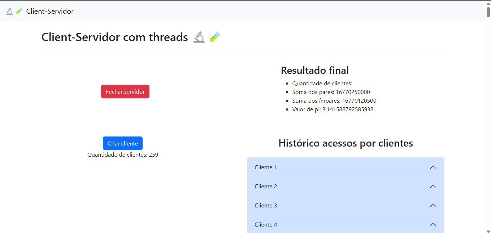

# Cliente-Servidor com Flask UI, Threading e Sockets

## Descrição

Criação de sockets em Python para trabalho 1 da disciplina de Redes de Computadores do curso de Engenharia de Computação da Universidade Federal do Pampa (UNIPAMPA).

### Dependências

  

### Instalação

1. Clone o repositório: `git clone https://github.com/lrafaelz/Cliente-Servidor-Multithread.git`
2. Navegue até o diretório do projeto: `cd Cliente-Servidor-Multithread`
3. Instale as dependências: `pip install -r requirements.txt`
4. Execute o projeto: `python app.py` (para rodar a UI Flask no localhost) e `python client.py` (para rodar o cliente no localhost)

## Autores

- Rafael Luz: [GitHub](https://github.com/lrafaelz)
- Tiago Dias: [GitHub](https://github.com/tiagodfer)

## Links Úteis

- [Documentação oficial do Flask](https://flask.palletsprojects.com/)
- [Documentação oficial do Flask-Threaded-Sockets](https://pypi.org/project/flask-threaded-sockets/)

## Funcionalidades

O Cliente-Servidor Multithread é capaz de calcular o valor de Pi utilizando um somatório
\[\pi \approx 4 \times \sum\_{n=a}^{b} \frac{-1^{n}}{2n+1}\]
Onde $a$ e $b$ são intervalos numéricos diferentes enviados a cada um dos clientes conectados ao servidor. A cada cliente conectado o servidor soma o resultado de seu resultado no somatório final a fim de obter as somas de pares e ímpares do intervalo e o valor aproximado de $\pi$ de forma descentralizada.

## Organização do Código

O programa está dividido em quatro partes principais: o(s) cliente(s), o servidor, a aplicação em Flask e a interface.

### Cliente

Em `client.py`, utilizando a biblioteca `socket` para abertura dos sockets TCP, estão definidas as funções a serem realizadas pelos clientes:

- **send**: onde a mensagem é codificada e enviada para o servidor;
- **receive**: onde a mensagem com o intervalo é recebida e verificada;
- **soma_pares** e **soma_impares**: onde são feitas as somas dos números pares e ímpares, respectivamente, do intervalo recebido;
- **pi**: onde é feito o cálculo do valor de pi dentro do intervalo dado para o somatório;
- **start**: onde é feito o controle das funções acima, bem como a conexão com o servidor através de sockets TCP;

### Servidor

Em `server.py`, utilizando as bibliotecas `socket` para abertura dos sockets TCP, `threading` para início do threads individualizados para cada cliente, `time` para obter os timestamps, e `json` para exportação dos resultados, é iniciado o servidor, utilizando as seguintes funções:

- **set**: onde são setadas as configurações do servidor;
- **handle_client**: onde é definido e enviado o intervalo, recebida a mensagem do cliente com as respostas, somado os valores para obter pi, e onde estas são impressas no json;
- **send**: onde a mensagem é codificada e enviada para o cliente;
- **receive**: onde a mensagem com a resposta é recebida e verificada;
- **final_result**: onde são recebidos os números enviados pelo cliente;
- **start**: onde é feito o controle das funções acima;

Já em `stop\_server.py` está um simples script na tentativa de utilizar um cliente como parada do servidor, o que infelizmente não foi possível.

### Interface

No arquivo `app.py` estão definidas as funções responsáveis pelas rotas da GUI. Atualmente, são quatro rotas que atualizam os estados da página utilizando a biblioteca Jinja, que permite a utilização de condições e loops em páginas HTML:

- **server**: carrega a página de controle do servidor, exibindo os resultados obtidos dos clientes;
- **create_client**: cria um novo cliente;
- **start_server** e **stop_server**: iniciam e param o servidor, respectivamente;
- **final_result**: exibe o resultado na tela;

## Resultados

Para avaliar a funcionalidade do Cliente-Servidor Multithread, realizamos testes. Os resultados foram obtidos a partir de múltiplas execuções da aplicação com diferentes números de clientes conectados ao servidor, e os valores aproximados de Pi foram calculados a partir dos intervalos fornecidos de tamanho 1000.

    
    
<b>Figura 1:</b> Teste com 259 conexões de clientes

Na Figura 1, observamos que o valor de Pi se aproxima do valor real conforme aumentamos o número de clientes conectados. Isso demonstra a eficiência do sistema em distribuir a carga de trabalho entre os clientes e somar os resultados de maneira precisa.

### Desempenho

Os testes de desempenho mostraram que a aplicação é capaz de gerenciar múltiplas conexões simultâneas sem degradação significativa na performance. A utilização de threads para cada cliente permitiu que o servidor lidasse com a comunicação e o processamento dos dados.
